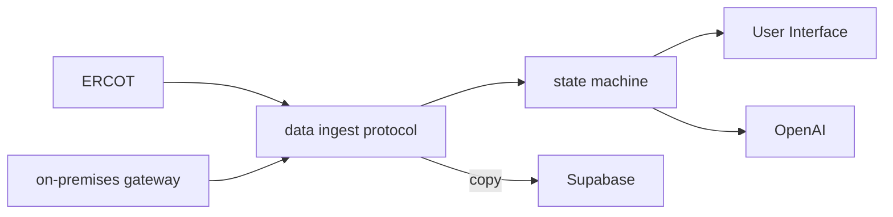

# grid state machine

Live at https://gridstatemachine.com/. 

## Submission

- [x] **Project title** — grid state machine
- [x] **2–5 min demo video** (Loom) — [Grid State Machine: Data Observability and Fleet Control](https://www.loom.com/share/4f817a223a5c4efc9bd7470e550d93ab)

  The recording is the running app: fleet map, a tick, **Now**, **Architecture**, one home, a chart flag, the maintenance ticket, and the decisions log.

- [x] **Repo link** (public) — https://github.com/alkarboly/grid-state-machine
    - [x] Quick start
    - [x] Tech stack and architecture diagram
    - [x] How to reproduce the demo (env vars, sample `.env`)
    - [x] Datasets / synthetic data and provenance
    - [x] Known limitations and next steps
- [x] **Deployed URL** — https://gridstatemachine.com/
- [x] **Team roster** (names, roles, contacts)
- [x] **Short write-up** (below)

### Team roster

| Name | Role | Contact |
| --- | --- | --- |
| Ahmed Alkarboly | Data Engineer | [ahmed.alkarboly@gmail.com](mailto:ahmed.alkarboly@gmail.com) |

## Quick start

Python 3.11+.

```
python -m venv .venv
.venv\Scripts\activate
pip install -r requirements.txt
copy .env.example .env
uvicorn gridsim.api:app --port 8000
```

On macOS or Linux, use `.venv/bin/activate` and `cp .env.example .env`.

Open http://127.0.0.1:8000. Startup fills 3000 homes and about two minutes of simulated history before the port opens. The page loads Three.js from a CDN. Leave `.env` blank: the public ERCOT dashboard still runs.

```
python -m unittest discover -s tests -t .
```

## Reproduce the demo

1. Copy `.env.example` to `.env`. Empty values are enough for the live dashboard, the map, the ladder, and the architecture tab.
2. Start the server as above and open http://127.0.0.1:8000 (or https://gridstatemachine.com/).
3. Fleet view: 24h demand and price, the Texas map, **Now** (price, day shape, fleet call, why it fired).
4. Click a city, then a home. Flag a chart on Disco or Base. The maintenance manager opens a ticket. The decisions log labels ladder and manager steps `[state machine]`.
5. Open **Architecture** (`/#architecture`).
6. Open **Protocols** (`/#protocols`) for when the state machine pushes, pulls, or holds.
7. Open **API** (`/#api`) for the public JSON routes.

Optional keys (never commit `.env`, never paste secrets into chat):

```
ERCOT_USERNAME=
ERCOT_PASSWORD=
ERCOT_SUBSCRIPTION_KEY=
SUPABASE_URL=
SUPABASE_SERVICE_ROLE_KEY=
OPENAI_API_KEY=
OPENAI_MODEL=gpt-4o-mini
```

The three `ERCOT_*` values turn on official prices and constraints. `SUPABASE_*` copies controller tables to hosted Postgres. `OPENAI_API_KEY` turns on a two-sentence summary of escalated service tickets. Deploy is [docs/deploy.md](docs/deploy.md). Sample file is `.env.example`.

## Tech stack

- Python 3.11, FastAPI, uvicorn — one process is the API and the map
- SQLite (`data/gridsim.db`, gitignored) — written every tick
- Optional Supabase (hosted Postgres) — copy of dispatch, market, and actions
- Three.js (CDN) — fleet map
- ERCOT public dashboard JSON; optional ERCOT Public API

## Architecture

Ingest takes the ERCOT snapshot and a simulated on-premises gateway stream and runs every home under the data contract. The state machine then chooses discharge, charge, or hold from Texas demand and ERCOT storage. OpenAI uses an incident summary data contract to select which data is shared with the LLM to auto-classify and summarize the incident. The API copies controller tables to Supabase when the keys are set. The browser only talks to this origin. Full path: [docs/architecture.md](docs/architecture.md).



## Datasets and synthetic data

| Source | What | Provenance |
| --- | --- | --- |
| ERCOT supply-demand and fuel-mix JSON | Live system demand, short forecast, power-storage megawatts | Public dashboard feeds, no key. URLs in [docs/ercot-sources.md](docs/ercot-sources.md). |
| ERCOT Public API (optional) | Binding constraints, settlement-point and bus LMPs | Official reports when `ERCOT_USERNAME`, `ERCOT_PASSWORD`, and `ERCOT_SUBSCRIPTION_KEY` are set. |
| `data/anchors.json` | 21 ERCOT metro points and household counts | Layout only. Counts are household estimates times an `adoption` multiplier (Central Texas weighted). Not customer addresses. [docs/simulation.md](docs/simulation.md). |
| Simulated fleet | 3000 Base-style homes: load, dispatch, sensor noise, charts | Generated in this process each tick. Gateway samples are generated here too; there is no field device. Disco hardware is unknown. |
| `web/geo.js` | Texas outline | Same outline the map draws. Homes that would land in water are rejected. |
| `data/station_geo.json` | Constraint endpoints | Empty unless you add a code pair ERCOT actually named. |

Do not commit `.env` or `data/gridsim.db`.

## Known limitations and next steps

- Architecture is hackathon grade
- Assumptions about telemetry data and modeling methods
- Focus on data capture to create control charts

## Short write-up

grid state machine is a data-observability and fleet-management prototype. It organizes telemetry so control can follow the data.

The UI starts at the market, then a service area, then one unit. That unit is a digital twin. Every 10 seconds it records voltage, frequency, temperature, alarms, and control charts.

There is a state machine that manages the entire fleet as well.
