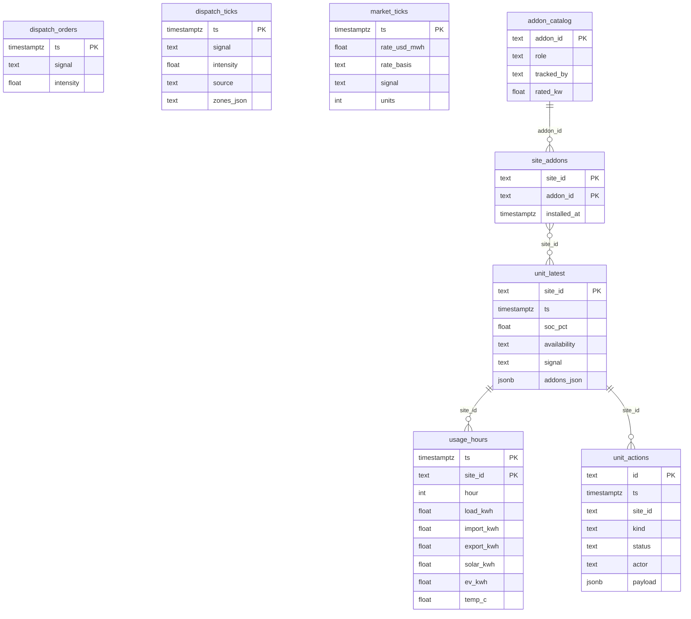

# Data model

The picture of the three SQL files in [deploy.md](deploy.md), and the record each disco keeps. Column lists stay in [database.md](database.md). The live sample shape stays in [contracts.md](contracts.md).

`site_id` is the home. There is no `sites` table in Supabase. Identity stays in local SQLite. Every Supabase row that names a home uses that same string (`aus-0004`) with no foreign key.

## Entity relationship

Eight tables. The only foreign key is `site_addons.addon_id` → `addon_catalog.addon_id`.



`dispatch_orders`, `dispatch_ticks`, and `market_ticks` are one row for the fleet, not one row per home. A tick's `ts` is the same clock on `dispatch_ticks` and `market_ticks`. They are not declared as a foreign key.

| Group | Tables | Who writes | Grain |
| --- | --- | --- | --- |
| Fleet call | `dispatch_orders` | A controller | Newest row wins. `auto` hands the fleet back to the ladder. |
| Fleet call | `dispatch_ticks` | Bot, every tick | One row per 10 seconds. No cap in Postgres. |
| Read model | `market_ticks` | Bot, every tick | Same clock as `dispatch_ticks`, plus `rate_usd_mwh` and `rate_basis`. |
| Read model | `unit_latest` | Bot | One row per published home, replaced in place. Cap 80 homes a tick. |
| Read model | `usage_hours` | Bot, when a clock hour closes | One row per published home per hour. |
| Disco install set | `addon_catalog` | Migration seed | `solar` (source, 5 kW) and `ev_charger` (load, 7.2 kW). `tracked_by` is `disco`. |
| Disco install set | `site_addons` | Bot, after `install_addon` or `remove_addon` | The add-ons that home's disco is metering now. |
| Actions | `unit_actions` | Fleet manager, maintenance manager, model, user, or the bot's `return_online` | One row per action. Open rows are `pending` or `active`. |

`unit_latest` and `usage_hours` are the instrumented cohort (60 homes) plus any home with an action or an add-on, and then cut at 80. The other 3000 homes stay in the process. Their disco samples are not copied to Supabase.

## Disco contract

The disco reports one sample each tick. The hardware behind that sample is unknown. The sample is generated in this process and presented as an on-premises gateway stream. There is no socket. The sample is not a table in the three SQL files.

```json
{
  "in_kw": 0.0,
  "out_kw": 1.24,
  "voltage_v": 240.1,
  "frequency_hz": 60.004,
  "contactor": "closed",
  "islanded": false,
  "addons": [
    { "addon_id": "solar", "role": "source", "kw": 3.2 }
  ]
}
```

`in_kw` is kilowatts from the utility toward the home. `out_kw` is the other way. A tied home has only one of them above zero. `contactor` is `closed` or `open`. `islanded` is true only while the contactor is open. `addons` is empty when nothing is installed. Order follows the catalog: `solar`, then `ev_charger`.

| Field | What the disco reports | How the sim builds it |
| --- | --- | --- |
| `in_kw`, `out_kw` | Power in and out | True net, plus gaussian noise of 0.06 kW. The billing meter uses 0.02 kW on the same net. Both are 0 while the contactor is open. |
| `voltage_v` | Volts | This service's own center, plus 0.12 V of noise. |
| `frequency_hz` | Hertz | One draw for the whole interconnection, plus 0.002 Hz at this disco. |
| `contactor`, `islanded` | Whether the home is grid-tied | Open and islanded only when the grid is turned off. Scheduled service does not open the contactor. |
| `addons[].kw` | Add-on power the disco is metering | `solar` is 5 kW times a daylight fraction, zero at night. `ev_charger` is 7.2 kW times 0.85 from 17:00 through 21:00, and zero otherwise. |

Three charts are computed from that sample. Each point is the mean of the ticks in the minute, and the alarm limit is ±3 times the one-tick standard divided by the square root of that count. The maintenance manager acts on an alarm past those limits. `frequency` is charted and left alone.

| `chart_id` | Residual | `sigma` |
| --- | --- | --- |
| `disco_meter_delta` | Disco net minus meter net. Expected is 0. | 0.20 kW |
| `disco_voltage` | `voltage_v` minus this service's center. | the unit's `voltage_sigma_v` |
| `frequency` | `frequency_hz` minus 60. | 0.025 Hz |

## Where a disco sample lands

| Store | What of the disco is kept | Which homes |
| --- | --- | --- |
| Process memory, `metrics.disco` | The full sample above, every tick | All 3000 |
| SQLite `metric_logs` | The same sample as `metrics_json`, `component` `disco` | Instrumented 60 |
| SQLite `observations` | `disco_in_kw`, `disco_out_kw`, `disco_voltage_v`, `frequency_hz`, `contactor`, `islanded` | Instrumented 60 |
| SQLite `control_points` | The three residuals above, plus the other three charts | Instrumented 60, and any home whose chart is out of limits |
| Supabase `usage_hours` | Not the sample. The hour integral: `load_kwh` is the panel, `import_kwh` and `export_kwh` are the grid, `solar_kwh` and `ev_kwh` are the add-on kilowatts the disco metered. `temp_c` is the mean cabinet temperature of every sample in that hour | Published homes, when the clock hour closes |
| Supabase `unit_latest.addons_json` | The installed ids, not the live kilowatts | Published homes, replaced each tick |
| Supabase `site_addons` | The same install set, one row per add-on | Homes whose disco list changed |

`load_kwh` on `usage_hours` is the panel, not `disco.in_kw`. Import and export on that row are the grid split, which is the true net, tighter than the disco. `solar_kwh` and `ev_kwh` are the only hour totals taken straight from `addons[].kw`.
